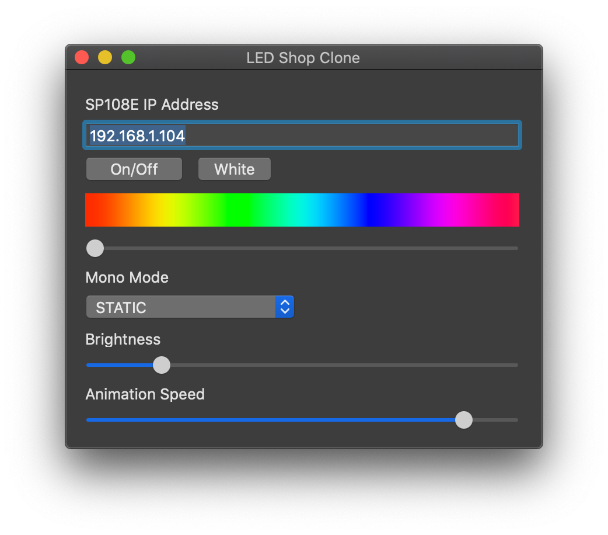

# LED Shop for macOS
A clone of LED Shop mobile app for macOS to control SP108E

# Features
### Available
- [x] Toggle On/Off
- [x] Select mono preset
- [x] Device state sync
- [x] Set brightness
- [x] Set animation speed
- [x] Set HUE (Currently limited to S=100, V=100)
- [x] Configure controller IP
- [x] Delayed start on launch
- [x] Turn on strip on launch
- [x] Turn off led strip on exit
- [x] Turn off led strip on enter sleep
- [x] Turn on led strip on wake from sleep

# Startup
To launch the app on login, please add it to login item

# Download
Please download from release page 

# Disclamier
The protocol was reverse engineered with wireshark and decompiled apk. This app is not by any means affiliated with spledapps
